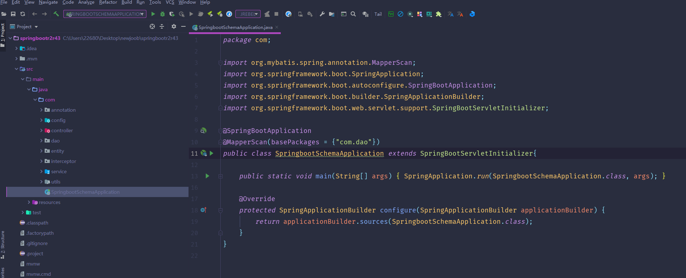
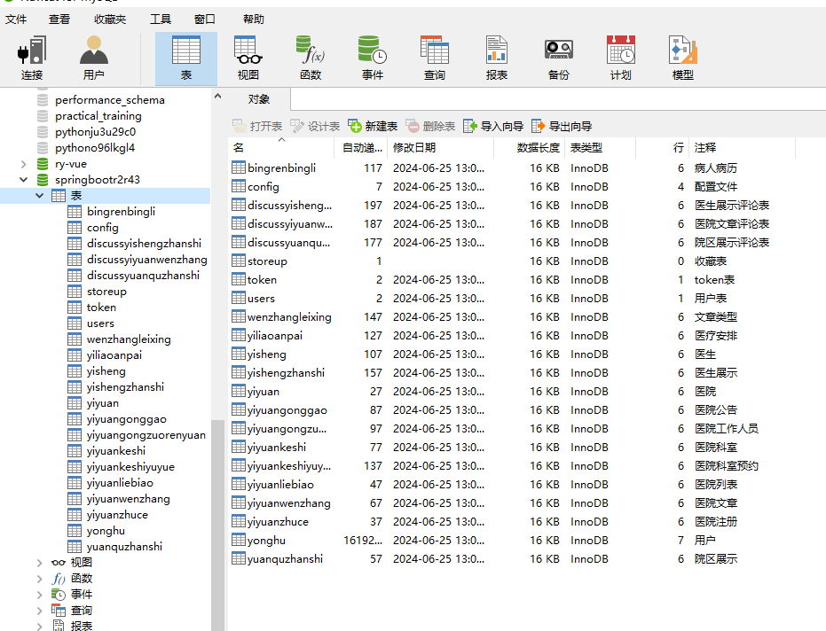
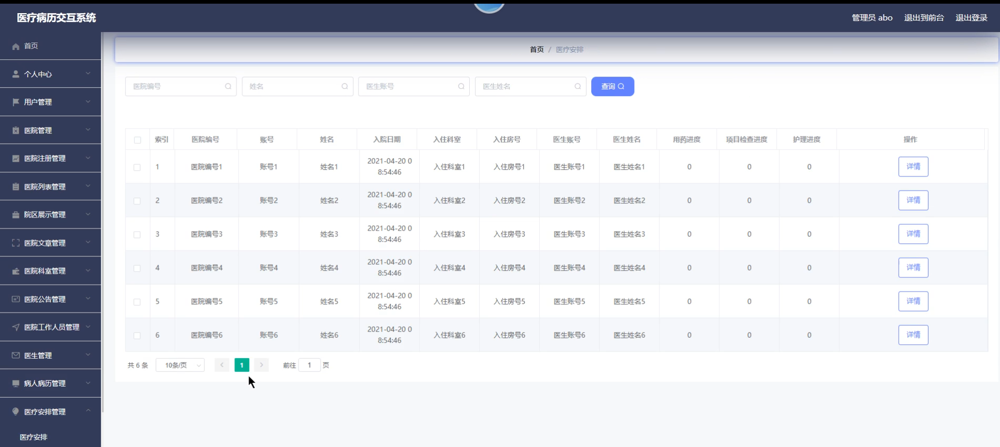
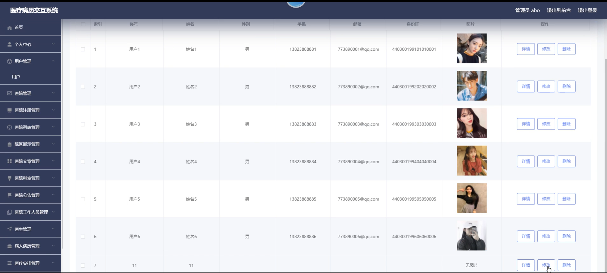
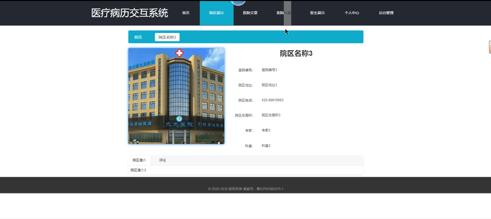
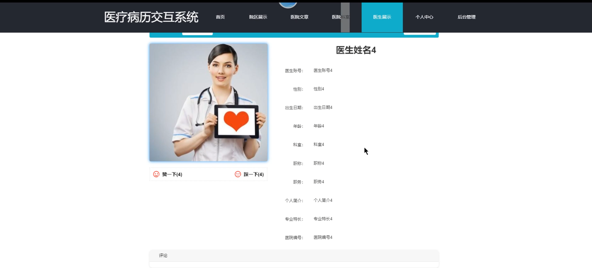
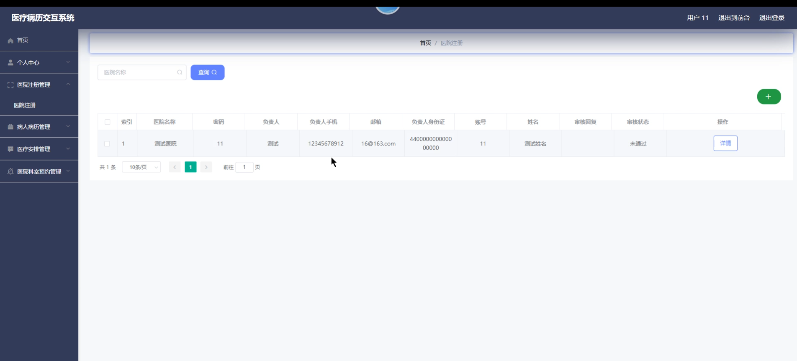
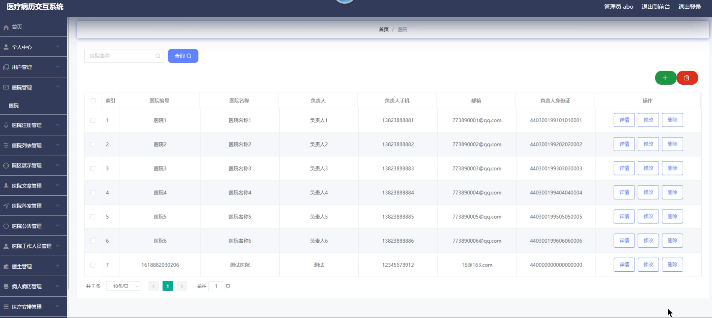
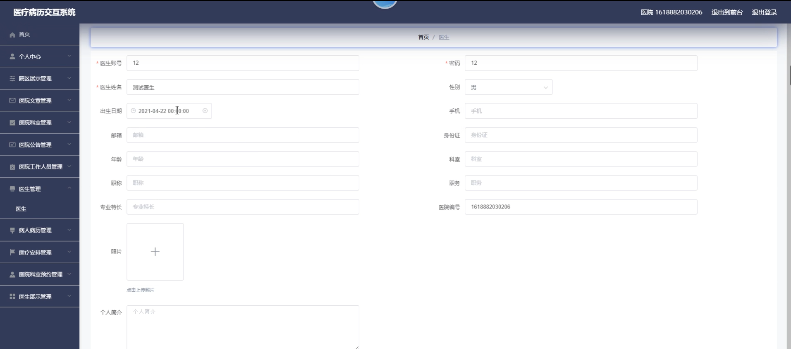
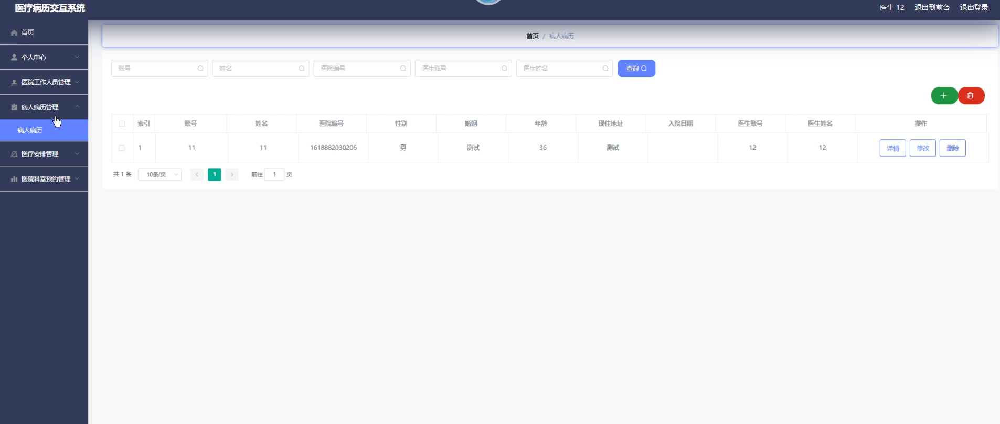

# 基于B2B平台的医疗病历交互系统

---
### 👉作者QQ ：1556708905 微信：zheng0123Long (支持定制修改、部署调试、定制毕设)

### 👉接网站建设、小程序、H5、APP、各种系统等

---

#### 介绍

在当今数字化医疗的时代背景下，我们开发了这款基于 B2B 平台的医疗病历交互系统，旨在优化医疗资源的配置，提高医疗服务的效率和质量，实现医疗信息的高效流通和共享。
本系统涵盖了管理员、医院、医生和用户等四种角色，通过明确各角色的职责和权限，构建了一个全面、协同、高效的医疗服务生态。

#### 技术栈

后端技术栈：Springboot+Mysql+Maven

前端技术栈：Vue+Html+Css+Javascript+ElementUI

开发工具：Idea+Vscode+Navicate

#### 系统功能介绍

（一）管理员功能模块    
个人中心：管理员在此模块可查看和修改自己的个人资料，如姓名、联系方式、登录密码等。还能查看自己的操作日志和系统通知。  
用户管理：全面掌控用户的详细信息，包括用户的基本资料（如姓名、年龄、性别、联系方式等）、账户状态（是否激活、是否受限）、注册时间等。支持对用户信息进行新增、修改、删除和精确查询，以确保用户数据的准确性和完整性。  
医院管理：对医院的基础信息进行细致管理，涵盖医院名称、地址、等级、所属类别等。同时，负责审核医院的资质文件，监督医院的服务质量，对存在问题的医院进行整改通知或暂停服务等操作。  
医院注册管理：处理医院的注册申请，严格审核医院提交的注册资料，包括营业执照、医疗许可证、医护人员资质等，确保注册医院的合法合规性和医疗服务能力。  
医院列表管理：维护一个详尽的医院列表，列表中清晰展示每家医院的关键信息，如名称、地址、联系方式、特色科室等。支持对列表进行排序（如按照地区、等级、好评度等）和筛选（通过特定条件快速找到目标医院），方便管理员进行统筹管理和用户查询。  
院区展示管理：负责对各个院区的外观环境、内部设施、科室分布等展示内容进行策划、编辑和更新。通过图片、文字、视频等多种形式，为用户呈现一个直观、全面的院区形象，帮助用户更好地了解院区情况。  
医院文章管理：对医院发布的各类文章进行审核，包括医疗科普、医院新闻、专家访谈等。确保文章内容的科学性、准确性和可读性，同时监督文章的发布流程，保障文章能够按时、高质量地推送给用户。  
医院科室管理：全面管理医院的科室设置，包括科室的新增、修改、删除等操作。详细记录每个科室的名称、简介、诊疗范围、医护人员配置等信息，确保科室信息的准确和及时更新，以方便患者查询和就医。  
医院公告管理：负责发布、编辑和删除医院的重要公告信息，如医院的营业时间调整、新科室开设、医疗政策变化等。确保公告内容准确、清晰，并能够及时传达给患者和医护人员。  
医院工作人员管理：对医院的工作人员信息进行综合管理，涵盖医生、护士、行政人员等。包括人员的基本信息（姓名、性别、职位、工作年限等）、资质证书（医生的执业证书、护士的资格证等）、工作安排（排班、值班、进修等）等，保障医院的人力资源合理配置和高效运作。  
医生管理：承担医生的注册审批工作，审核医生的资质证书、学历背景、从业经历等。对已注册医生的信息进行维护和更新，如工作调动、职称晋升、奖惩记录等。同时，监督医生的服务质量，处理患者对医生的投诉和建议。  
病人病历管理：采用严格的加密和备份措施，确保病人病历的安全存储。提供便捷的病历查询功能，支持按照病人姓名、病历号、疾病类型等条件进行快速检索。对病历的修改和删除进行权限控制和操作记录，保障病历数据的完整性和准确性，为医疗诊断和研究提供可靠的依据。  
医疗安排管理：根据医院的资源状况和病人的需求，合理协调和安排医疗服务，包括手术安排、检查预约、住院床位分配等。实时监控医疗安排的执行情况，及时处理突发状况和调整安排，以提高医疗资源的利用率和服务效率。  
医院科室预约管理：处理患者对医院科室的预约请求，根据科室的繁忙程度和医生的排班情况进行智能分配。提供预约的查询、修改和取消功能，同时向患者发送预约确认和提醒信息，优化医疗服务流程，减少患者等待时间。  
文章类型管理：对医院文章的类型进行细致分类，如疾病防治、康复护理、医疗新技术介绍等。设定每种类型文章的发布规范和审核标准，确保文章的多样性和专业性，方便用户根据需求快速找到感兴趣的内容。  
医生展示管理：精心策划医生的展示页面，包括医生的照片、简介、擅长领域、患者评价等。对展示内容进行审核和优化，确保信息真实准确且有吸引力，突出医生的专业特长和优势，提升医生的知名度和患者的信任度。  
（二）用户功能模块  
院区展示：用户能够直观地查看各个院区的详细介绍，包括院区的规模、设施配备、环境图片等，还能通过虚拟现实（VR）或视频展示了解院区的实际布局和特色区域。  
医院文章：方便地阅读医院发布的各类科普文章、医疗动态、健康小贴士等，获取权威且实用的医疗信息，提升自身的健康意识和医疗知识水平。  
医院科室：清晰了解医院的科室设置，包括科室的名称、简介、诊疗范围等详细信息，能够根据自身需求快速找到对应的科室。  
医生展示：查看医生的个人信息，如照片、姓名、职称、从医经历、擅长治疗的疾病等，帮助用户选择适合自己的医生。  
个人中心：管理个人的基本信息，如姓名、联系方式、家庭住址等，还能查看自己的就诊记录、预约历史、病历信息等。  
医院注册管理：如果是新用户，可以通过此功能进行医院的注册操作，填写相关个人信息和健康状况等。  
病人病历管理：随时查看自己的病历详情，了解过往的诊断结果、治疗方案、用药情况等，方便与医生沟通和进行后续的治疗。  
医疗安排管理：查看自己的医疗安排，如预约的检查时间、手术安排、复诊日期等，并且可以根据实际情况进行调整或取消。  
医院科室预约管理：根据自己的需求选择合适的医院科室进行预约，查看科室的可预约时间和医生排班，提交预约申请并接收预约结果通知。  
（三）医院功能模块  
院区展示：以图文并茂、视频等丰富形式全面展示院区的环境、设施、特色服务，突出院区的优势和特色，吸引更多患者前来就医。  
医院文章：自主发布医院的新闻动态、专家出诊信息、成功案例分享、健康科普知识等文章，提升医院的知名度和影响力。  
医院科室：对医院内部科室进行详细的介绍和管理，包括科室的人员配备、设备情况、诊疗项目更新等。  
医生展示：全方位展示医生的专业形象和个人风采，包括医生的教育背景、工作经历、学术成果、患者好评等。  
个人中心：医院相关工作人员在此管理个人信息，查看工作任务和通知。  
院区展示管理：根据医院的发展和变化，及时更新院区展示的内容，确保信息的准确性和时效性。  
医院文章管理：对发布的文章进行编辑、审核、删除等操作，保证文章质量和合规性。  
医院科室管理：灵活调整科室设置，优化科室资源配置，根据患者需求和医疗技术发展新增或改进科室服务。  
医院公告管理：及时发布重要的医院通知，如停诊信息、医保政策调整、优惠活动等。  
医院工作人员管理：对医院内部的医生、护士、行政人员等进行信息登记、工作安排、绩效考核等管理。  
医生管理：负责医生的入职、离职手续办理，医生信息的更新和维护，以及医生的培训和进修安排。  
病人病历管理：安全存储和管理病人的病历资料，方便医生随时查阅，为诊断和治疗提供依据。  
医疗安排管理：合理安排医院的医疗资源，包括病床分配、手术排期、检查设备调度等，提高医疗服务效率。  
医院科室预约管理：实时处理患者的科室预约请求，根据科室的繁忙程度和医疗资源进行合理分配。  
医生展示管理：不断优化医生的展示页面，突出医生的专业特色和优势，提升患者对医生的信任度和选择意愿。  
（四）医生功能模块  
院区展示：深入了解所在医院的院区分布、设施配备和环境特点，为患者提供更准确的引导和介绍。  
医院文章：阅读医院发布的各类专业文章和通知，掌握最新的医疗动态和学术研究成果。  
医院科室：清晰了解本科室以及其他相关科室的详细情况，包括人员构成、业务范围和协作流程。  
医生展示：更新和完善个人展示信息，突出自己的专业特长、学术成就和临床经验。  
个人中心：管理个人的基本资料、工作安排和患者沟通记录。  
病人病历管理：详细查阅患者的病历，了解病史、诊断结果、治疗方案和用药情况，为当前的诊疗提供参考。  
医疗安排管理：查看自己负责的患者的医疗安排，合理调整治疗计划和随访时间。  
医院科室预约管理：处理患者对本科室的预约申请，根据实际情况进行确认或调整。  
在线诊断：通过系统与患者进行远程沟通，初步了解病情，给出诊断建议或引导患者进一步就医。  
医嘱管理：为患者制定个性化的医嘱，包括用药指导、饮食建议、康复训练等。  
治疗记录：实时记录患者的治疗过程和效果，便于后续的跟踪和分析。  
学术交流：参与医院内部或与其他医生的学术讨论和经验分享，提升专业水平。  

#### 系统作用

（一）提升医疗服务效率  
通过优化医疗资源的配置和预约管理，减少患者等待时间，提高医院的运营效率，使医疗服务更加快捷、高效。  
（二）促进医疗信息共享  
实现病人病历在不同角色之间的安全共享，医生和医院能够更全面地了解患者病史，为精准治疗提供支持。  
（三）增强医疗服务透明度  
患者可以通过系统了解医院的科室、医生信息以及医疗安排，提高了医疗服务的透明度，增加患者对医疗服务的信任。  
（四）便于医疗管理与监督  
管理员能够全面掌控系统内的各项事务，进行有效的管理和监督，保障医疗服务的质量和合规性。  
（五）提升医疗服务质量  
医生能够更便捷地获取患者信息和医疗资源，为患者提供更优质的医疗服务。  

#### 系统功能截图

代码结构

数据库表

登录

医疗安排

前台页面首页

用户管理

院区展区

医生展示

用户端后台管理

医院注册

医院管理

医院端后台管理

医生端病人病例

#### 总结

本基于 B2B 平台的医疗病历交互系统，通过精心设计的功能模块和明确的角色分工，构建了一个高效、透明、协同的医疗服务体系。它不仅提升了医疗服务的效率和质量，还促进了医疗信息的共享和管理的规范化，为医疗行业的数字化发展提供了有力的支持，有望为广大患者带来更便捷、更优质的医疗体验。

#### 使用说明

创建数据库，执行数据库脚本 修改jdbc数据库连接参数 下载安装maven依赖jar 启动idea中的springboot项目

后台地址：http://localhost:8080/springbootr2r43/admin/dist/index.html

管理员  abo 密码 abo

前台地址：http://localhost:8080/springbootr2r43/front/index.html

